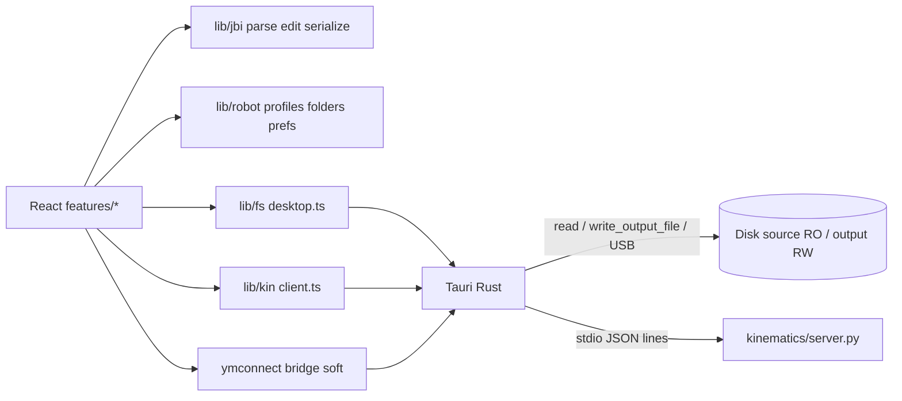

# AGENT_HANDOFF — Yaskawa Job Helper

Dense briefing for coding agents. Human runbook: [`docs/DEVELOPER_GUIDE.md`](docs/DEVELOPER_GUIDE.md).  
**Do not** invent unfinished features as done. **Do not** edit the Cursor plan file unless the user asks.

**GitHub:** https://github.com/icors2/Yaskawa-Job-Helper  
**App / git root:** `yaskawa-job-editor/` (this folder is the repository root).  
Parent workspace may also contain `Yaskawa Jobs/` (full controller backup — **SENSITIVE**) and `Manuals/` (PDFs — large/proprietary). **Never commit those.**

---

## How to use this handoff (token strategy)

1. **Read this file first** — architecture, map, invariants, gates, where-to-change.
2. **Open listed files only when editing that area** (table below). Prefer 1–3 files over repo-wide search.
3. **Grep only to** (a) verify a claim here after parallel edits, or (b) find call sites *after* reading the map.
4. **Skip** dumping whole files into context; use section anchors + exports.
5. **Parallel work risk:** another agent may touch `features/transform`, `features/wizard`, `lib/jbi/edit.ts` (speeds), `stop.bat`. If behavior disagrees with this doc → **verify if PR in flight**; re-read those paths before changing them.

| Task | Open first |
| --- | --- |
| Nav / chrome / gates | `src/App.tsx`, `src/components/Sidebar.tsx`, `src/lib/setup/progress.ts` |
| Parse / serialize | `src/lib/jbi/parse.ts`, `serialize.ts`, `model.ts` |
| Speeds / weld / line edits | `src/lib/jbi/edit.ts`, `cnd.ts` |
| Frame move / transform | `src/lib/jbi/frameTransform.ts`, `src/features/transform/index.tsx`, `kinematics/transform.py` |
| Calibration / write gate | `src/features/calibration/storage.ts`, `wizard.tsx`, `lib/calibration/*`, `kinematics/calibrate.py` |
| Profiles / folders | `src/lib/robot/profile.ts`, `folders.ts` |
| Kin protocol | `src/lib/kin/client.ts` ↔ `kinematics/server.py` |
| FS / USB / sidecar spawn | `src-tauri/src/fs_commands.rs`, `media.rs`, `sidecar.rs`, `src/lib/fs/desktop.ts` |
| YMConnect | `src/lib/kin/ymconnect.ts`, `src-tauri/src/ymconnect.rs`, `ymconnect/` |

---

## Meta

| | |
| --- | --- |
| **One-liner** | Offline-safe YRC1000 `.JBI` editor: lossless parse/edit/serialize + Motoman FK/calibration/transforms via Python sidecar |
| **Stack** | Tauri **v2** + React/TS/Tailwind + Vite; Python stdio kinematics sidecar |
| **Repo** | https://github.com/icors2/Yaskawa-Job-Helper |
| **App root** | `C:\Users\icors\Documents\Yaskawa Job editing\yaskawa-job-editor\` |
| **Workspace** | `C:\Users\icors\Documents\Yaskawa Job editing\` |
| **Backup corpus** | `../Yaskawa Jobs/DYNAMIC1` (~300 `.JBI` + CND/PRM) — local only, gitignored |
| **Manuals** | `../Manuals/` — local only, gitignored |
| **Flip assist source** | `../Assets/Flip assist.png` → bundled as `src/assets/flip-assist.png` (dual-station). Single-side: `Flip assist left.png` / `Flip assist right.png` → `flip-assist-left.png` / `flip-assist-right.png` |
| **Transform fixtures** | `fixtures/transform/` (+ `kinematics/testdata/transform/`) — synthetic USER cartesian before/after for transfer / YZ / single-side / **offset +100 X** |
| **Parent launchers** | `../Start Yaskawa Job Editor.bat`, `../Stop Yaskawa Job Editor.bat` |

### Run / stop / tests

| Action | Command |
| --- | --- |
| Start | `start.bat` → `npm run dev` (Tauri+Vite); PID in `.dev.pids`; optional `--install` |
| Stop | `stop.bat` → kill tree from `.dev.pids`, then path-matched node/vite/tauri/cargo |
| Dev port | **1420** (`vite.config.ts` `strictPort`); HMR 1421 if `TAURI_DEV_HOST` |
| Vite-only | `npm run dev:vite` (no FS/sidecar) |
| Kin alone | `npm run kin` → `python kinematics/server.py` |
| Roundtrip | `npm run test:roundtrip` — fixtures + DYNAMIC1 ≈ **305** byte-identical (needs local backup) |
| Edit helpers | `npm run test:edit` |
| Kin unit | `npm run test:kin` |
| Transform fixtures | `npm run test:transform` |
| S1→S2 regression | `npm run test:regression` |
| Types | `npx tsc --noEmit` |

Quick: `npm install` → `pip install -r kinematics\requirements.txt` → tests → `start.bat`.

---

## Architecture

**Data flows**

1. **Jobs:** source folder → `read_text_file` → parse → edit → serialize → unified diff → `write_output_file` under output only.
2. **Geometry:** pulses → `forward_kinematics` / `transform_*` (sidecar) → new `///POSTYPE USER` groups (`frameTransform.ts`).
3. **Profiles:** backup scan/create in Python → store in `localStorage` → optional mirror `<output>/profiles/robot_profiles.json` → `load_profile` into sidecar.
4. **Gates:** ProfileGate (session) → forced Setup (min steps) → calibration gate for geometry + Diff/Wizard writes.

**Output-only writes:** Rust `write_output_file` resolves paths under the active output folder; refuses write with no output set. Never overwrite source/backup tree.

---

## Directory map

### UI / app

| Path | Purpose |
| --- | --- |
| `src/App.tsx` | ProfileGate, forced setup, folder restore, page router, shared `activeJobPath` |
| `src/main.tsx` | React mount |
| `src/index.css` | Motoman theme tokens + Tailwind `@theme` / component classes |
| `src/components/Sidebar.tsx` | Nav labels (Setup **not** listed) |
| `src/components/StatusBar.tsx` | Status, sidecar ping, setup/calib shortcuts |
| `src/features/startup/ProfileGate.tsx` | Blocking robot select/create each session |
| `src/features/setup/` | Forced Setup Guide + YMConnect + MotoROS2 panels |
| `src/features/wizard/` | Job Editing Wizard (intent → diff → write) |
| `src/features/library/` | Loaded Jobs + dbl-click → Wizard/Manual modal |
| `src/features/editor/` | Manual Editor |
| `src/features/calibration/` | Manual fit UI + Guided wizard + gate storage |
| `src/features/transform/` | Transfer / Mirror / **Single-side mirror** / Offset + flip assist demos |
| `src/features/diff/` | Unified diff, dry-run, write, USB export hook |
| `src/features/export/UsbExportPanel.tsx` | Removable drive export from output |
| `src/assets/flip-assist.png` | Dual-station Flip assist diagram |
| `src/assets/flip-assist-left.png` / `flip-assist-right.png` | Single-station demos (XYZ origin anchors) |

### TS libs

| Path | Purpose |
| --- | --- |
| `src/lib/jbi/model.ts` | `JobFile`, pos kinds, CRLF contract |
| `src/lib/jbi/parse.ts` | Lossless parse; NPOS validate |
| `src/lib/jbi/serialize.ts` | Byte-identical emit; optional NPOS recompute |
| `src/lib/jbi/library.ts` | Index, CALL/PSTART, rename/refs |
| `src/lib/jbi/edit.ts` | Insert/delete/reorder; V=/VJ=; weld tokens |
| `src/lib/jbi/cnd.ts` | ARCSRT/ARCEND/WEAV inventory validate |
| `src/lib/jbi/diff.ts` | Unified diff + validation report |
| `src/lib/jbi/frameTransform.ts` | PULSE→USER frame-move; USER cartesian transfer; mirror / single-side (same UF); offset; optional pulse-axis flips |
| `src/lib/robot/profile.ts` | Multi-profile store, install gate, CAL_* names |
| `src/lib/robot/pulseMirrorPrefs.ts` | Per-profile advanced S/L/U/R/B/T sign knobs (default identity) |
| `src/lib/robot/folders.ts` | Per-profile source/output; `YaskawaJobEditor_Output` |
| `src/lib/robot/ymconnectPrefs.ts` | Per-profile YMConnect host/group |
| `src/lib/robot/motoros2Prefs.ts` | Optional MotoROS2 prefs (setup only) |
| `src/lib/setup/progress.ts` | Setup v3 progress / force / finish |
| `src/lib/calibration/*` | STANDARD/RELATIVE generators, home→±limit steps, session |
| `src/lib/kin/client.ts` | **Kin protocol SoT** (v1.0.0) |
| `src/lib/kin/ymconnect.ts` | ConvertPosition client (separate from kin) |
| `src/lib/fs/desktop.ts` | Tauri FS invokes |
| `src/lib/fs/paths.ts` | Path join helpers |

### Rust / Python / other

| Path | Purpose |
| --- | --- |
| `src-tauri/src/lib.rs` | Command registration |
| `src-tauri/src/fs_commands.rs` | Folders, list/read JBI, output-scoped write |
| `src-tauri/src/media.rs` | Removable drives, USB export, `ensure_directory` |
| `src-tauri/src/sidecar.rs` | Spawn + `kin_request` stdio |
| `src-tauri/src/ymconnect.rs` | Bridge status + ConvertPosition |
| `kinematics/server.py` | Stdio JSON dispatcher |
| `kinematics/ar2010.py` | S-L-U-R-B-T FK template |
| `kinematics/robot_model.py` | Profile → DH params |
| `kinematics/robot_profile.py` | Backup scan/create/load |
| `kinematics/calibrate.py` | Pair fit / residuals; home→±limit scale seeding |
| `kinematics/transform.py` | Frame move / mirror / **offset (USER/BASE XYZ + fixed-frame RPY)** |
| `kinematics/cnd.py` | UFRAME/TOOL readers |
| `kinematics/RC_PRM_FINDINGS.txt` | RC.PRM geometry hypothesis (AR2010 holds) |
| `kinematics/regression_s1_s2.py` | Frame-move regression |
| `ymconnect/` | C# ConvertPosition bridge stub (soft dep) |
| `fixtures/` | Small `.JBI` + SYSTEM/TOOL/UFRAME samples (**OK to commit**) |
| `scripts/roundtrip.ts` | Roundtrip gate |
| `scripts/edit-test.ts` | Edit/speed/weld tests |
| `scripts/transform-test.ts` | Transfer / mirror / SSM / offset fixture checks |
| `docs/DEVELOPER_GUIDE.md` | Human install/run |
| `docs/MOTOMAN_DEVELOPER_FINDINGS.md` | Portal / INFORM / YMConnect research |
| `docs/MOTOROS2.md` | MotoROS2 adopt vs ignore |
| `start.bat` / `stop.bat` | Windows launchers |

---

## Domain: YRC1000 JBI

**Shape (lossless):** `/JOB` → headers (`//NAME` …) → `//POS` groups → `//INST` → instructions. Newline always `\r\n` + trailing newline. Preserve `raw` on headers, pos vars, inst lines.

**POS groups:** `///POSTYPE` PULSE|USER|BASE|…; `///USER` / `///TOOL`; vars `C`/`BC`/`EC`/`P`/`BP`/`EX`.  
**`///NPOS` order:** `C,BC,EC,P,BP,EX` counts (`serialize.ts` `formatNpos`).

**Pulse vs USER/BASE**

- Production jobs often `///POSTYPE PULSE`.
- **Transfer / frame move:** FK each pulse pose in **source** UF → emit same relative XYZ/RPY as `///POSTYPE USER` + `///USER <target>`. Instructions untouched. **No IK in v1** (controller resolves joints).
- **Transfer** = identical fixtures (geometry relative to fixture unchanged; only frame id).
- **Mirror** / **Single-side mirror** = reflection across plane in the **same** `///USER` (same station for single-side). Keep source `RCONF`, flag pendant review. Prefer cartesian USER/BASE; PULSE→FK→USER then mirror. Optional advanced pulse-axis sign knobs are approximate until cell-calibrated.
- **Offset (shift)** = XYZ mm added in current USER/BASE frame; RPY deg applied as **fixed-frame** rotation (`R' = R_delta @ R`). PULSE jobs: FK→USER in source frame, then offset, emit USER. Verified with `USER_CART_S1_OFF_X100.JBI` (+100 mm X).

**Speed rules** (`edit.ts`)

| Token | Allowed on |
| --- | --- |
| `VJ=` | `MOVJ` only |
| `V=` | `MOVL` / `MOVC` / `SMOVL` only |
| Dual `V=`+`VJ=` | Illegal — `sanitizeSpeedModifiers` strips |

Weld path: indices strictly between `ARCON`…`ARCOF` (nested depth) for weld-speed targeting.

**Safety (non-negotiable)**

1. Never write source/backup in place.
2. Writes → output folder only (`YaskawaJobEditor_Output` beside source by default).
3. Diff before treating edit as write-ready; Diff dry-run available.
4. Calibration gate for transforms + Diff/Wizard writes (Library browse OK without).
5. USB export from **output** only → e.g. `YaskawaJobs/` on remediable media.

---

## Calibration (home → ± safe limits)

**Design (operator-confirmed):**

1. **Home is the anchor** — every joint range starts from the known safe home pose.
2. **Full *safe* range per joint** (not mechanical max): from home, jog each axis to farthest safe **positive** and **negative** in the cell; record each as one taught position (prefer **MOVL**; MOVJ OK if needed). Labels: `S+`, `S-`, … `T+`, `T-`.
3. **CAL jobs:** `CAL_<robotId>_STANDARD.JBI` + `CAL_<robotId>_RELATIVE.JBI` — one PAUSE / one position per checklist step (home, UF RORG/RXX/RXY, then 12 joint-limit steps, optional extra).
4. **Workspace-limited mode** (default ON): still allows **Skip** if one direction is unclear; *goal* is both sides when safe.
5. **`calibrate.py`:** up-weights joint-limit pairs; seeds `pulse_per_degree` from home→±limit Δpulses/Δdegrees before least_squares.
6. **TODO when cartesian production jobs arrive:** re-validate **mirror** and **offset/shift** against real USER/BASE jobs (synthetic fixtures are interim). Leave conversion-pair import stubbed until cell data exists.

| Piece | Path |
| --- | --- |
| Step defs (home, UF, S+/S−…) | `src/lib/calibration/steps.ts` |
| JBI + README generators | `src/lib/calibration/jobGenerator.ts` |
| Wizard UI | `src/features/calibration/wizard.tsx` |
| Fit / residuals | `kinematics/calibrate.py` |
| Gate storage | `src/features/calibration/storage.ts` |

---

## Robot profiles & setup

**Required backup files:** `SYSTEM.SYS`, `RC.PRM`, `TOOL.CND`, `UFRAME.CND`  
**Recommended:** `RE.PRM`, `SV.PRM`, `ARCSRT.CND`, `ARCEND.CND`, `WEAV.CND`

**Flow**

1. **ProfileGate** every session (`sessionStorage` confirm) — select/create profile.
2. **Setup Guide** forced until minimum: robotInstall, sourceFolder, outputFolder, cndFiles, safety. Calibration may **Skip for now**.
3. `isProfileSetupFinished` → skip forced setup → land **Loaded Jobs**.
4. Header **Robot:** dropdown switches active profile; folders restore per profile.

**Auto output:** `<parent of source>\YaskawaJobEditor_Output` (`OUTPUT_FOLDER_BASENAME`).

**Online (optional)**

| Path | Status |
| --- | --- |
| YMConnect ConvertPosition | Soft dep; prefs + bridge stub; **untested on cell** |
| MotoROS2 | Setup prefs/checklist only; **no ROS client**; does not block install |

### Storage keys (exact)

| Key | Where | Notes |
| --- | --- | --- |
| `yaskawa.session.profileConfirmed.v1` | **sessionStorage** | ProfileGate confirmed this tab |
| `yaskawa.robot.profiles.v1` | localStorage | Profiles + `activeProfileId` |
| `yaskawa.folders.v1` | localStorage | Per-profile source/output |
| `yaskawa.setup.v1` | localStorage | Setup progress **version 3** |
| `yaskawa.calibration.v1` | localStorage | Legacy / mirror of active |
| `yaskawa.calibration.v1.<profileId>` | localStorage | Per-profile applied fit + `gated` |
| `yaskawa.calibration.session.v1` | localStorage | Guided capture session |
| `yaskawa.ymconnect.v1` | localStorage | Per-profile host/controlGroup |
| `yaskawa.motoros2.v1` | localStorage | Per-profile agent prefs |
| `yaskawa.pulseMirror.v1.<profileId>` | localStorage | Advanced pulse-axis mirror signs (default identity) |

Disk mirror: `<output>/profiles/robot_profiles.json` (`ROBOT_PROFILES_FILENAME`).

**Calibration gate:** active profile + stored record with `gated: true` when `worstMm ≤ thresholdMm` (default **1.0**). Else transforms + edit writes blocked (`getCalibrationGate` / `getEditWriteGate`).

---

## Sidecar JSON protocol

**SoT:** [`src/lib/kin/client.ts`](src/lib/kin/client.ts) — `KIN_PROTOCOL_VERSION = "1.0.0"`. Keep in sync with `kinematics/server.py`.

**Transport:** one camelCase JSON object per stdin line → one response line. Tauri `kin_request`.

| Method | Role |
| --- | --- |
| `ping` | Health / protocol string |
| `forward_kinematics` | Pulses → pose (tool/UF/calib optional) |
| `calibrate` | Pulse↔cartesian pairs → params + residuals |
| `transform_frame` | Pulse rows source UF → poses in target UF |
| `transform_mirror` | Cartesian poses × plane XY\|XZ\|YZ |
| `transform_offset` | Poses + delta (XYZ frame add; RPY fixed-frame) |
| `read_uframe` / `read_tool` | Parse CND paths |
| `scan_backup` | Required/recommended file presence |
| `create_profile_from_backup` | Build profile from backup folder |
| `load_profile` / `get_profile` | Sidecar active profile state |

**Units:** pose `x,y,z` mm; `rx,ry,rz` deg. Pulses length-6 **S,L,U,R,B,T**.

YMConnect is **not** this protocol — `ymconnect_convert_position` / `src/lib/kin/ymconnect.ts`.

---

## UI routes & labels

**Sidebar (order):** Job Editing Wizard · Loaded Jobs · Manual Editor · Calibration · Transform · Diff  

**Not in sidebar:** Setup Guide (header / StatusBar / first-run / incomplete gate only).

| Page id | UI label | Notes |
| --- | --- | --- |
| `wizard` | Job Editing Wizard | Intents: rename, duplicate, frameMove, mirror/offset→Transform, speed, weld, findReplace, manual. Writes need edit-write gate |
| `library` | Loaded Jobs | Dbl-click → choose Wizard or Manual Editor |
| `editor` | Manual Editor | Full line/speed/weld/CND tooling |
| `calibration` | Calibration | Manual + Guided; export `CAL_<id>_STANDARD/RELATIVE.JBI` |
| `transform` | Transform | Modes: **Transfer** \| **Mirror** \| **Single-side mirror** \| **Offset** + flip assist (dual or left/right assets) |
| `diff` | Diff | Preview / dry-run / write / USB |
| `setup` | Setup Guide | Forced until min complete |

Wizard mirror/offset intents navigate to Transform (geometry lives there).

---

## Where to change X

| Want | Touch |
| --- | --- |
| Rename nav label | `Sidebar.tsx` `NAV_ITEMS` |
| Add sidebar page | `AppPage` + `Sidebar` + `App.tsx` render |
| Forced setup steps | `lib/setup/progress.ts` `SETUP_STEP_ORDER` / `MINIMUM_SETUP_STEPS` + `features/setup` |
| Add transform mode | `features/transform` mode union + UI; kin method if new math; maybe wizard intent |
| Calibration steps / CAL jobs | `lib/calibration/steps.ts`, `jobGenerator.ts`, `features/calibration/wizard.tsx` |
| Gate threshold / logic | `features/calibration/storage.ts` |
| Fix serializer / roundtrip | `parse.ts` / `serialize.ts` — then `test:roundtrip` |
| Speed / weld rules | `lib/jbi/edit.ts` (+ `test:edit`) |
| Frame-move / offset emission | `lib/jbi/frameTransform.ts` + `kinematics/transform.py` |
| Add Tauri command | `src-tauri/src/*.rs` + `lib.rs` handler + `lib/fs` or kin wrapper |
| Change FK / DH | `kinematics/ar2010.py`, `robot_model.py` — `test:kin` |
| Profile required files | `lib/robot/profile.ts` `PROFILE_REQUIRED_FILES` + `robot_profile.py` |
| Theme tokens | `src/index.css` (`--app-*`, `@theme`) |
| Dev port | `vite.config.ts` |
| Stop behavior | `stop.bat` (**verify if PR in flight**) |

---

## Invariants / do-not-break

1. **Byte-identical roundtrip** of fixtures + DYNAMIC1 (~305) after parse/serialize changes (local backup).
2. **No** `MOVL … V= … VJ=…` (or V on MOVJ / VJ on linear) — sanitize + tests.
3. **Calibration gate** before transforms and Diff/Wizard writes; Library read-only browse OK.
4. **Output-only** FS writes; source folder never destination.
5. **Preserve `raw`** fields for lossless serialize unless intentionally rewriting.
6. **Motoman theme tokens** in `index.css` — prefer `bg-bg`, `text-accent`, `btn-primary`, etc. over ad-hoc zinc/amber.
7. **Kin protocol 1.0.0** camelCase — TS ↔ Python stay aligned.
8. **NPOS order** `C,BC,EC,P,BP,EX`.
9. TS style: no semicolons; `handle*` event handlers; Tailwind for UI.
10. Do not edit Cursor plan file unless asked.
11. **Never commit** `Yaskawa Jobs/`, `Manuals/`, `*.pdf`, CMOS/bin backups, or plant calibration session JSON.

---

## Known gaps / future

| Gap | Notes |
| --- | --- |
| YMConnect live ConvertPosition | Stub builds without SDK; needs NuGet/DLL + Ethernet cell test |
| MotoROS2 live topics | Prefs/checklist only; no subscribed ROS 2 client |
| Non–S-L-U-R-B-T DH | v1 Motoman 6-axis only |
| Bulk pulse→relative import | **Disabled stub** in Calibration Guided wizard until real cell pairs |
| Auto CALL rewiring on station change | Partial / manual rename-refs |
| Joint-limit checks | Cartesian reach heuristic only |
| Wizard ↔ Transform | Mirror/offset intents redirect; keep UX consistent if both edit |
| **Real cartesian backups** | Prefer USER/BASE jobs for mirror/single-side/**offset**; synthetic fixtures in `fixtures/transform/` until cell uploads — **TODO: re-validate mirror/shift when cartesian production jobs arrive** |
| Pulse-axis mirror knobs | Advanced/approximate; defaults identity until cell-calibrated — not ground truth |
| Live Guided ±limit sessions | UI/generators ready; needs cell operator capture |

**Suggested next work:** run Guided calibration with home→±limits on cell; link YMConnect SDK + golden ConvertPosition set; re-validate mirror/offset on real USER jobs; optional ROS 2 `joint_states` snapshot helper; enable conversion-pair import when data exists.

---

## Pitfalls

- Editing `serialize` formatting → mass roundtrip FAIL + `*.roundtrip-fail` artifacts.
- Skipping `raw` preservation when mutating headers/inst lines.
- Assuming calibration optional for writes — Setup can finish; **writes stay locked**.
- Writing paths outside output — Rust rejects / wrong folder.
- Treating YMConnect as required — soft dep; offline FK is primary.
- Hardcoding AR2010 in UI — use **active robot profile**.
- Dual speed tokens from pendant jobs — sanitize before rewrite.
- `sessionStorage` profile confirm ≠ setup finished; both gates exist.
- Committing parent `Yaskawa Jobs/` or `Manuals/` — blocked by `.gitignore`; double-check `git status`.
- Parallel edits to transform/wizard/speeds/`stop.bat` — re-read before merge.

---

## Verification checklist for agents

After changes, run the smallest sufficient set:

| Changed area | Run |
| --- | --- |
| `parse` / `serialize` / model | `npm run test:roundtrip` **required** (needs local DYNAMIC1) |
| `edit.ts` / speeds / weld | `npm run test:edit` |
| `kinematics/*.py` / protocol | `npm run test:kin`; if frame math → `test:regression` |
| `frameTransform` / transform fixtures | `npm run test:transform` (+ `test:kin` for Python fixture asserts) |
| TS types / UI props | `npx tsc --noEmit` |
| Broad / release confidence | roundtrip + edit + kin + transform + manual `start.bat` smoke |

**Re-read before trusting this handoff if stale:**

- Nav: `Sidebar.tsx`
- Keys: `profile.ts`, `folders.ts`, `progress.ts`, `calibration/storage.ts`, `App.tsx` session key
- Transform modes: `features/transform/index.tsx`
- Calibration steps: `lib/calibration/steps.ts` (home + S+/S− …)
- Protocol methods: `lib/kin/client.ts` ↔ `server.py` header
- Launchers: `start.bat`, `stop.bat`
- Gates: `getCalibrationGate`, `shouldForceSetup`, `isProfileSetupFinished`

---

## Status snapshot (2026-08-22)

**Done:** Tauri scaffold; lossless JBI; library; Manual Editor + edit tests; Wizard; Diff/USB; multi-profile + ProfileGate + forced Setup; calibration UI + gate with **home-anchored ± safe joint limits** (CAL STANDARD/RELATIVE); Transform transfer/mirror/**single-side mirror**/offset (+100 X fixture) + flip assist; `fixtures/transform/`; kin sidecar FK/calib/transform/profile; YMConnect stub; MotoROS2 setup prefs; `start.bat`/`stop.bat`; GitHub repo `icors2/Yaskawa-Job-Helper`.

**Not done:** live YMConnect cell; MotoROS2 ingest; bulk conversion import; full CALL auto-rewire; non-6-axis DH; calibrated pulse-axis mirror signs; **re-validate mirror/shift on real cartesian production jobs** (TODO).

*If transform/wizard/speeds/`stop.bat` disagree with this file → verify mid-flight PR and update this handoff.*
